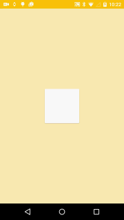
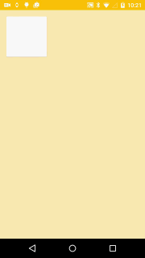
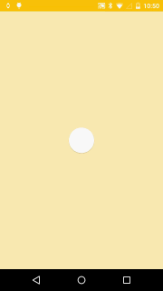
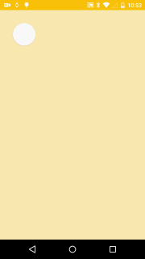

# MaterialMorphing
Examples of material morphing

## Scaling shapes
It can be done as well with java and xml. In this example, we will use the ObjectAnimator for scaling a CardView.

Here is an xml example of ObecjtAnimator implementation:

```xml
<objectAnimator
        android:duration="500"
        android:propertyName="scaleX"
        android:valueFrom="1"
        android:valueTo="2"
        android:valueType="floatType"/>
```

There are several ways to instantiate an object animator, here we will use 2 : 

*ObjectAnimator.ofFloat*

> public static ObjectAnimator ofFloat (Object target, String propertyName, float... values)

> Constructs and returns an ObjectAnimator that animates between float values. A single value implies that that value is the one being animated to. Two values imply starting and ending values. More than two values imply a starting value, values to animate through along the way, and an ending value (these values will be distributed evenly across the duration of the animation).

```java
// scale the size from original (1f) to double (2f)
ValueAnimator scaleXTwice = ObjectAnimator.ofFloat(mCardView, View.SCALE_X, 1f, 2f);
```

*ObjectAnimator.ofPropertyValuesHolder*

> public static ObjectAnimator ofPropertyValuesHolder (Object target, PropertyValuesHolder... values)

> Constructs and returns an ObjectAnimator that animates between the sets of values specified in PropertyValueHolder objects. This variant should be used when animating several properties at once with the same ObjectAnimator, since PropertyValuesHolder allows you to associate a set of animation values with a property name.

```java
// scale the size from triple (3f) to original (1f)
PropertyValuesHolder holderX = PropertyValuesHolder.ofFloat(View.SCALE_X, 3f, 1f);
PropertyValuesHolder holderY = PropertyValuesHolder.ofFloat(View.SCALE_Y, 3f, 1f);
ObjectAnimator scaleToOrig = ObjectAnimator.ofPropertyValuesHolder(mCardView, holderX, holderY);
```
Here is an example



As you can see, when scaling to the big square, first the width is scaled then the height. It follows Google recommendations, when morphing a piece of the UI, to avoid confusing the morphing with a piece moving on the z axis, it's better to scale the x and y axis with different offsets. However, on this set of animation specifically, It's not possible to apply this effect on the scaling back to original size. I tried applying different offsets but for the last transformation, it seems that the offset is not interpreted correclty, Android is just resizing the width then the height sequentially while the height should start resizing a little after the width started resizing (so x and y animation happen partially at the same time).

This animation can be declined in many different ways, here is the same animation but we fix the top left corner so that it won't move during the animation



To achieved this, we need to set a pivot the animated view
```java
// fix top left corner
mCardView.setPivotX(0);
mCardView.setPivotY(0);
```

## Custom interpolator
If the current interpolators are not suited for the app usage, you can create one by extending an existing one or create one in xml. But if you use xml, you cannot create a custom one, see : https://github.com/castorflex/SmoothProgressBar/issues/16, you can only override one.
In this example, I overrode the PathInterpolator:

```xml
<?xml version="1.0" encoding="utf-8"?>
<pathInterpolator xmlns:android="http://schemas.android.com/apk/res/android"
                  android:controlX1="0.75"
                  android:controlX2="0"
                  android:controlY1="0.75"
                  android:controlY2="1"/>
```

## Morphing shapes
One way to create morphing animations is using the ValueAnimator object and listen to animation updates. For each update, we can calculate the next state of the view and update it accordingly.
Here is an example to morph a circle into a square : 
```java
// From circle to small square
ValueAnimator toSmallSquare = ObjectAnimator.ofFloat(1, 0); // A set of values that the animation will animate between over time.
toSmallSquare.addUpdateListener(new ValueAnimator.AnimatorUpdateListener() {
    @Override
    public void onAnimationUpdate(ValueAnimator animation) {
        // Redraw the cardview on each update

         float fraction = (float) animation.getAnimatedValue();
	// update the cardView rounded corners
	mCardView.setRadius(interpolate(origRadius, targetRadius, fraction));

	// update cardview size
	if (origWidth != targetWidth) {
	    mCardView.getLayoutParams().width = (int) ((targetWidth - origWidth) * (1 - fraction) + origWidth);
	}
	if (origHeight != targetHeight) {
	    mCardView.getLayoutParams().height = (int) ((targetHeight - origHeight) * (1 - fraction) + origWidth);
	}

	// request the cardview to redraw
	mCardView.requestLayout();
    }
});

private float interpolate(int from, int to, float fraction) {
	return ((from - to) * fraction) + to;
}
```



It is also possible to have an animation with a fix point that won't move during the animation. To achieve it, we'll need to fix the cardview position in xml using the margin.


